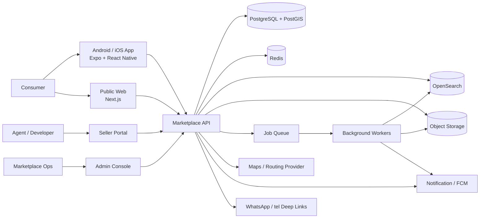
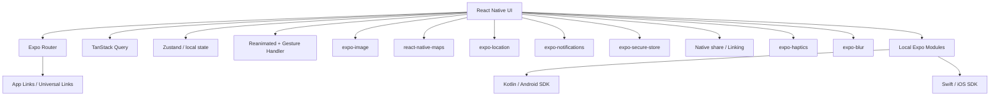
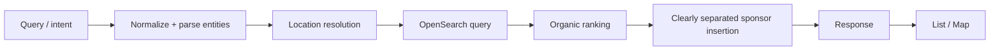
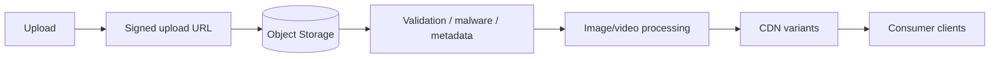
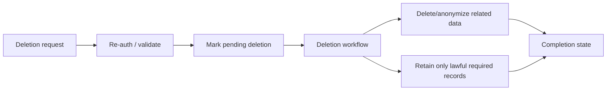

# ARCHITECTURE — [APP_NAME] Property Marketplace

**Version:** 3.0  
**Date:** 28 September 2026  
**Architecture style:** Expo/React Native native mobile client + modular-monolith backend + dedicated search/media/geospatial infrastructure + separate SEO/web surfaces  
**Primary goal:** production-grade architecture that can launch on Google Play while remaining maintainable for a small-to-medium engineering team.

---

## 1. Architectural Drivers

The architecture is optimized for:

- one reusable native consumer product codebase across Android and iOS;
- Google Play compliance and Android platform evolution;
- premium animation/media-heavy UX without sacrificing reliability;
- native access for maps, geolocation, push, secure storage, app links, and integrity signals;
- fast property search and geospatial queries;
- privacy-aware location handling;
- large image/video inventory;
- collaborative decision state;
- seller/developer inventory management;
- safe future extraction into services without starting with microservices.

---

## 2. System Context



---

## 3. Consumer Client Strategy

### 3.1 Chosen stack

```text
Expo SDK 57 (stable production baseline)
React Native 0.86
React 19.2
TypeScript
Expo Router
TanStack Query
Zustand (ephemeral client state)
Zod + React Hook Form
React Native Reanimated + Gesture Handler
FlashList
Expo Image / Blur / Haptics / Location / Notifications / SecureStore
react-native-maps
EAS Build / Submit / Update
```

The mobile app is a real React Native application. Android and iOS share feature/domain code while still rendering platform-native views and using native platform services.

### 3.2 Production baseline

- Expo SDK **57** as the stable baseline on 28 September 2026.
- React Native **0.86** and React **19.2.x** through the Expo SDK compatibility matrix.
- Android `compileSdkVersion = 36` and `targetSdkVersion = 36` through the Expo SDK baseline.
- Android 7+ framework capability; product minimum may be raised after Indonesian device-distribution analysis.
- iOS 16.4+ capability for the shared iOS build.
- Android App Bundle for Play production.
- Play App Signing.
- 16 KB native-library compatibility audit.
- New Architecture only, consistent with current Expo SDK generations.
- Expo SDK 58 beta is explicitly excluded from production until stable and regression-qualified.

### 3.3 Why Expo / React Native

Expo is selected because this product is UI-, search-, map-, media-, notification-, and workflow-heavy but does not require a game-engine or highly specialized continuous native sensor pipeline. It gives the team:

- one Android/iOS product codebase;
- native UI rather than WebView UI;
- reproducible native configuration with config plugins/CNG;
- controlled AAB/IPA builds through EAS;
- Expo Modules escape hatches for Kotlin/Swift;
- excellent support for image-heavy, gesture-heavy, animated mobile UX;
- fast iteration without sacrificing Play Store readiness.

### 3.4 Native escape hatch

A local Expo Module may be implemented in Kotlin/Swift when:

- no maintained Expo/RN module exists;
- native performance/security is required;
- Play Integrity or platform security needs tighter hooks;
- OS-specific behavior cannot be expressed reliably in JavaScript;
- a critical third-party SDK requires a native bridge.

Custom native modules MUST remain narrow, typed, tested, and documented through an ADR.

## 4. Expo Runtime and Native Generation Model

### 4.1 Development modes

Use three clearly separated modes:

1. **Expo Go** — optional early UI exploration only; never the source of truth for production behavior.
2. **Development Build (`expo-dev-client`)** — default daily development environment for native modules, maps, notifications, auth redirects, app links, and realistic configuration.
3. **Release Build** — EAS/Gradle/Xcode production artifact with no dev client, no dev menu, no debug endpoints, and production credentials/configuration.

### 4.2 Continuous Native Generation

The project SHOULD use Expo config plugins and Continuous Native Generation:

```text
app.config.ts
   +
Expo config plugins
   ↓
expo prebuild / EAS Build
   ↓
android/ + ios/ generated native projects
   ↓
Gradle / Xcode native build
```

Generated `android/` and `ios/` directories SHOULD not become hand-edited sources of truth unless a documented requirement makes that necessary. Native customization should prefer:

- Expo config plugins;
- local Expo Modules;
- upstream maintained RN modules.

### 4.3 OTA update governance

`expo-updates` / EAS Update MAY be used for approved JavaScript and asset fixes. Production governance MUST include:

- explicit production channel/branch;
- runtime-version compatibility;
- staged rollout when risk warrants it;
- rollback procedure;
- source-map/error-observability linkage;
- prohibition on using OTA to introduce undeclared native features or bypass store policy/review.

## 5. Mobile Native Integration Architecture



### 5.1 Module policy

Third-party native modules MUST be:

- compatible with the pinned Expo SDK / React Native New Architecture;
- actively maintained;
- permission-audited;
- privacy/data-inventory reviewed;
- checked for transitive native binaries and 16 KB compatibility;
- covered by release-build smoke tests.

### 5.2 Map policy

`react-native-maps` is the P0 production map baseline because `expo-maps` is still alpha in Expo SDK 57. `expo-maps` may be evaluated later behind an ADR after it becomes stable and meets feature/performance requirements.

### 5.3 Secure storage

Use `expo-secure-store` for refresh/session secrets. Non-sensitive caches/preferences may use AsyncStorage/MMKV-equivalent storage after privacy review. Server authorization remains authoritative.

## 6. Consumer Application Structure

Recommended monorepo:

```text
apps/
├── mobile/                   # Expo / React Native consumer app
├── web/                      # Next.js public/SEO consumer web
├── seller-portal/            # Next.js seller/developer portal
└── admin-console/            # Next.js restricted admin app

packages/
├── domain/                   # Shared TypeScript entities/schemas
├── api-client/               # Typed API client
├── analytics/                # Event contracts
├── design-tokens/            # Cross-surface semantic tokens
├── config/                   # Shared validated config types
└── tooling/

modules/
└── native/                   # Local Expo Modules if required

services/
└── marketplace-api/
```

Within `apps/mobile`:

```text
src/
├── app/                      # Expo Router file-based routes
│   ├── (tabs)/
│   ├── property/
│   ├── project/
│   ├── search/
│   ├── saved/
│   ├── mortgage/
│   └── profile/
├── components/
├── features/
│   ├── auth/
│   ├── home/
│   ├── search/
│   ├── map/
│   ├── listing/
│   ├── saved/
│   ├── compare/
│   ├── mortgage/
│   ├── projects/
│   └── profile/
├── lib/
│   ├── api/
│   ├── analytics/
│   ├── auth/
│   ├── storage/
│   └── permissions/
├── state/
└── theme/
```

Feature modules own their UI/state/query contracts. Components do not call native modules directly unless the dependency is intentionally encapsulated behind a feature/platform service.

## 7. Navigation and Deep Linking

### 7.1 Expo Router model

Primary routes include:

```text
/(tabs)/home
/(tabs)/search
/(tabs)/saved
/(tabs)/profile
/property/[slug]
/project/[slug]
/developer/[slug]
/search/filters
/search/map
/collection/[id]
/mortgage/[id]
/account/delete
```

The visual bottom navigation SHOULD use `expo-router/ui` headless tabs or a custom React Navigation/Expo Router composition when the premium floating-glass treatment cannot be achieved cleanly with system tabs. Native tabs MAY be reconsidered once their stable API and visual constraints match the product.

### 7.2 App Links / Universal Links

- verified Android HTTPS App Links;
- iOS Universal Links when iOS ships;
- `assetlinks.json` and `apple-app-site-association` hosted on controlled domains;
- package/bundle identifiers and signing associations configured per environment;
- browser fallback to equivalent public web page;
- sensitive routes validate authorization server-side.

### 7.3 Back/navigation behavior

- modal/bottom sheet dismisses before route pop;
- fullscreen gallery exits before detail route;
- detail returns to retained search/map state;
- Android hardware/system back exits only from root;
- state restoration survives process recreation for user-important flows where feasible.

## 8. Supporting Web Applications

### Public Consumer Web

Recommended **Next.js** application optimized for:

- indexable listing/project/developer pages;
- canonical share URLs;
- structured data and metadata;
- web account-deletion path;
- responsive research/discovery;
- deep-link fallback into the Expo app.

### Agent/Seller Portal

Next.js web application with:

- responsive desktop-first UX;
- role-based access;
- listing/project/unit CRUD;
- media upload;
- lead inbox;
- moderation status;
- analytics;
- audit-visible actions.

### Admin Console

Separate restricted Next.js application with:

- strong authentication and MFA;
- RBAC/least privilege;
- moderation/report queue;
- seller/developer verification;
- taxonomy/configuration;
- audit logs;
- feature flags;
- operational metrics.

Mobile and web share domain schemas, API contracts, analytics taxonomy, and semantic design tokens where useful. They do not need to share rendered UI components.

## 9. Backend Strategy

Start with a **modular monolith** exposed through a versioned API/BFF.

Benefits:

- simpler transaction boundaries;
- easier deployment/observability;
- lower operational cost;
- clear module seams for future extraction.

Recommended implementation:

```text
Node.js LTS
TypeScript
NestJS or Fastify-based modular application
PostgreSQL + PostGIS
Redis
OpenSearch
Object storage + CDN
Job queue (BullMQ/compatible)
OpenTelemetry
```

### Domain modules

```text
Identity
UserProfile
Preferences
Advertiser
Agency
Developer
Listing
Project
Search
SavedWorkspace
Comparison
Collaboration
Mortgage
Lead
Notification
Moderation
Media
Geospatial
AnalyticsEvents
Audit
```

Modules communicate through explicit interfaces/events, not direct cross-table writes from arbitrary code.

---

## 10. API / BFF Design

Consumer clients use `/v1` JSON APIs.

Example:

```text
GET    /v1/search
GET    /v1/listings/:id
POST   /v1/saved-properties
DELETE /v1/saved-properties/:id
POST   /v1/collections
POST   /v1/collections/:id/invitations
POST   /v1/mortgage/simulations
POST   /v1/leads
GET    /v1/projects/:id
POST   /v1/account/deletion-requests
```

### API rules

- JSON schema validated at boundaries.
- Stable error envelope.
- Cursor pagination for large result sets.
- Idempotency keys for lead/save/deletion actions where useful.
- ETag/conditional caching for public detail resources where appropriate.
- Rate limiting by route/risk class.
- No private database identifiers exposed unnecessarily.

---

## 11. Data Architecture

### 11.1 PostgreSQL + PostGIS

Canonical transactional store.

Core tables/entities:

```text
users
user_profiles
user_preferences
favorite_places
advertisers
agencies
developers
listings
listing_specs
listing_locations
listing_media
listing_facilities
listing_tags
price_history
projects
project_clusters
project_units
project_progress
project_promotions
saved_properties
saved_searches
collections
collection_members
collection_properties
comparisons
mortgage_simulations
leads
listing_reports
notifications
audit_events
```

Money stored in integer minor units or a documented decimal strategy; never binary floating point for financial values.

### 11.2 Search index

OpenSearch holds denormalized searchable documents containing:

- location hierarchy;
- geospatial point/shape;
- type/transaction;
- normalized price;
- specs;
- tags/facilities;
- developer/project metadata;
- quality/freshness fields;
- promotion metadata;
- availability state.

PostgreSQL remains canonical.

### 11.3 Cache

Redis for:

- session/risk auxiliaries where required;
- search/result fragments;
- rate limits;
- ephemeral collaboration/invitation state;
- job coordination;
- short-lived map/route cache.

---

## 12. Search Pipeline



Natural-language intent is converted into explicit filters that the user can inspect/edit. The system must not silently invent a budget/location constraint.

---

## 13. Geospatial Architecture

PostGIS handles canonical geometry and area queries. Search index handles fast result geospatial filtering.

Map provider handles:

- basemap rendering;
- geocoding/autocomplete where licensed;
- routing/travel time;
- POI lookup where permitted.

Rules:

- Android API keys restricted by package/signing certificate where provider supports it;
- server keys stay server-side;
- exact private seller coordinates never sent to clients when listing precision is approximate/hidden;
- map viewport requests are debounced and cancellable;
- list/map result IDs remain consistent.

---

## 14. Media Pipeline



Requirements:

- validate MIME/content, not extension only;
- strip sensitive EXIF where appropriate;
- generate multiple responsive sizes;
- modern image formats where client support permits;
- low-quality preview/placeholder;
- explicit media ordering;
- moderation state;
- CDN cache invalidation strategy.

Client should prefetch only adjacent gallery media, not whole albums.

---

## 15. Authentication and Session Security

### Consumer authentication

- guest browsing;
- Google OAuth/OIDC;
- phone OTP;
- optional WhatsApp verification provider.

### Token model

- short-lived access token in memory where possible;
- refresh credential protected using a Keystore-backed secure storage plugin/native implementation;
- rotation/revocation support;
- no refresh secret exclusively in plain `localStorage`.

### Agent/admin

- stronger assurance;
- MFA for privileged roles;
- RBAC;
- session/device audit;
- step-up auth for sensitive actions.

### Play Integrity

Risk signals MAY be evaluated for abuse-sensitive actions such as:

- suspicious account creation;
- high-volume lead spam;
- automated scraping;
- invitation abuse;
- high-risk account mutation.

Integrity signals are advisory inputs, not the sole authorization mechanism.

---

## 16. Privacy Architecture

### Data minimization
Each field must have documented purpose, retention, and system owner.

### Location
- manual location works without device permission;
- precise location requested in context only;
- no background location in launch scope;
- saved office/favorite places require explicit user action.

### Account deletion



The same backend flow serves in-app and external web deletion requests.

---

## 17. Notification Architecture

```text
Domain event
→ notification rule engine
→ user preference/consent check
→ queue
→ FCM
→ Android notification
→ deep link
```

Categories:

- transactional;
- saved-search/property update;
- collaboration;
- project update;
- marketing.

Marketing notifications must be independently controllable.

---

## 18. Lead / WhatsApp Handoff

```text
User taps WhatsApp
→ POST /leads (idempotent)
→ backend records attribution
→ app receives handoff payload
→ native/browser intent opens WhatsApp
→ fallback: copy number / call / inquiry
```

Do not require Contacts, SMS, or Call Log permissions for this flow.

---

## 19. Offline and Resilience

The product is network-first but should degrade gracefully.

Cache locally:

- app shell assets;
- last search metadata;
- recent listing summaries;
- saved workspace snapshot;
- reference taxonomies;
- image caching via `expo-image`, HTTP cache headers, query persistence, and CDN.

Do not cache private sensitive responses indefinitely.

Failure strategy:

- stale-while-revalidate for safe public data;
- retry with backoff for idempotent operations;
- optimistic save/favorite with reconciliation;
- explicit sync-error state;
- map provider failure falls back to list/area text;
- contact fallbacks when third-party apps are missing.

---

## 20. Observability

### Client

Capture:

- JavaScript errors;
- unhandled promise rejections;
- route performance;
- React Native JS/native render failures;
- native bridge/plugin failures;
- API latency/error;
- map failures;
- crash/ANR data from Android tooling;
- release/build metadata.

### Server

- structured logs;
- OpenTelemetry traces;
- metrics by domain;
- search latency;
- queue delay;
- media processing failures;
- external provider latency;
- moderation/lead workflows.

PII must not be copied into telemetry by default.

---

## 21. Security Controls

- TLS only.
- Strict API authorization.
- Input/schema validation.
- CSP for web surface where applicable.
- Explicit allowlist for external browser/app handoffs from mobile.
- No cleartext production API traffic except explicitly approved development cases.
- Secure cookie strategy for web; token strategy for mobile.
- Signed upload URLs.
- Media validation.
- Rate limiting and abuse detection.
- Secrets in managed secret store.
- Dependency and container scanning.
- SAST/secret scanning.
- Administrator MFA.
- Audit trail for privileged actions.
- Security review for third-party Expo/React Native native modules.

---

## 22. CI/CD

### Mobile pipeline

```text
install dependencies
→ expo-doctor
→ typecheck
→ lint
→ unit/component tests
→ API contract tests
→ EAS development/preview build as required
→ Maestro / device E2E
→ production EAS Build (AAB)
→ artifact/signing verification
→ Play internal/closed track
→ staged production rollout
```

Release CI MUST verify:

- pinned stable Expo SDK and compatible package versions;
- no Expo Go/dev-client dependency in production artifact;
- environment/secret separation;
- production EAS Update channel/runtime version;
- target/compile SDK;
- version code/name;
- signing configuration;
- native dependency inventory;
- 16 KB compatibility evidence where native `.so` libraries are present;
- permission diff against approved manifest;
- privacy SDK inventory artifact;
- source maps uploaded securely to observability provider;
- no client-exposed secrets.

### EAS profiles

`eas.json` SHOULD contain at least:

```text
development   → dev client, internal distribution
preview       → production-like internal QA
production    → store AAB/IPA, production env/update channel
```

### Backend/web pipeline

```text
lint/typecheck
→ unit tests
→ integration tests
→ migrations check
→ container/web build
→ security scan
→ staging deploy
→ contract/E2E
→ production deploy
```

## 23. Google Play Build Requirements

- target SDK 36+ under current submission rule.
- compile SDK 36+.
- AAB production output.
- Play App Signing.
- deterministic versioning.
- 16 KB page-size compatible native dependencies.
- no release debug flags.
- Expo dev menu/dev client absent from production.
- production EAS Update channel/runtime version verified.
- Android network security configuration reviewed.
- permission manifest minimized.
- verified App Links.
- privacy policy/account deletion URLs live before submission.
- Data Safety based on actual SDK/data behavior.
- Play pre-launch report reviewed.
- closed testing completed if account eligibility requires it.

---

## 24. Deployment Topology

Recommended baseline:

```text
CDN / WAF
   |
Load Balancer / Reverse Proxy
   |
Marketplace API (2+ replicas when traffic warrants)
   |
PostgreSQL primary + managed backups
Redis
OpenSearch
Object Storage + CDN
Worker pool
```

Start managed where practical. Avoid Kubernetes until operational requirements justify it.

---

## 25. Architecture Decision Records

Create/maintain at least:

- ADR-001 Expo/React Native client vs Kotlin-only / Capacitor.
- ADR-002 Separate native mobile and SEO web surfaces with shared domain packages.
- ADR-003 Mobile authentication token storage.
- ADR-004 Map provider/native map implementation.
- ADR-005 Search engine and ranking boundary.
- ADR-006 Modular monolith boundaries.
- ADR-007 Location privacy model.
- ADR-008 Media processing/CDN.
- ADR-009 Notification provider.
- ADR-010 Analytics/privacy model.
- ADR-011 16 KB native dependency audit.

---

## 26. Current Platform References

Re-check before every major release:

- Expo SDK reference: https://docs.expo.dev/versions/latest/
- Expo SDK 57: https://expo.dev/changelog/sdk-57
- Expo Router: https://docs.expo.dev/router/introduction/
- EAS Build: https://docs.expo.dev/build/introduction/
- EAS Update: https://docs.expo.dev/eas-update/introduction/
- Google Play target API: https://support.google.com/googleplay/android-developer/answer/11926878
- Account deletion/user data: https://support.google.com/googleplay/android-developer/answer/10144311
- Android 16 KB pages: https://developer.android.com/guide/practices/page-sizes
- Android App Bundle: https://developer.android.com/guide/app-bundle
- Play App Signing: https://support.google.com/googleplay/android-developer/answer/9842756
- Play Integrity: https://developer.android.com/google/play/integrity/overview

