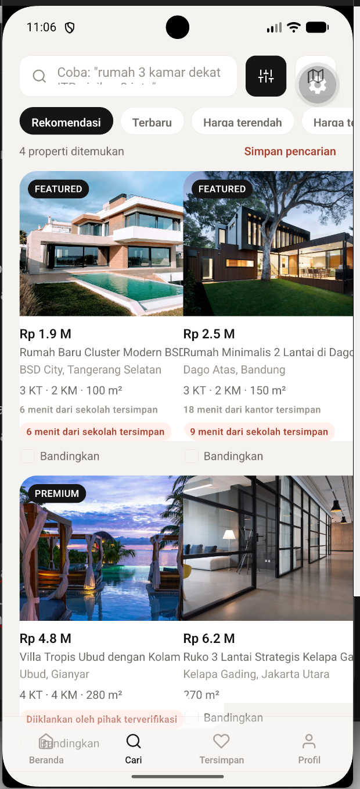
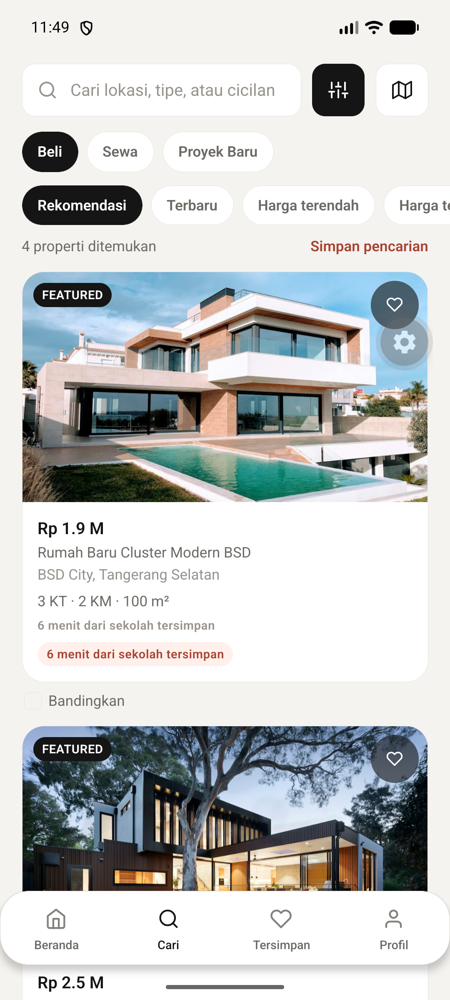
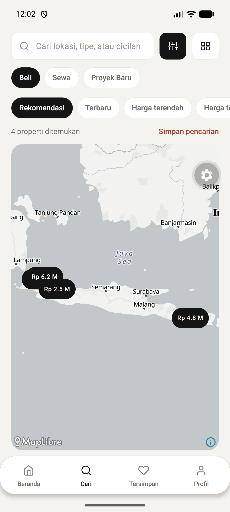

# Audit alur, fitur, dan tampilan Huni — 29 September 2026

## Cakupan dan cara melihatnya

Audit ini menelusuri rute aplikasi, `DESIGN.md`, katalog Supabase yang sedang dipakai emulator Android, dua tangkapan layar yang dikirim pengguna, serta layar Beranda, Cari (daftar, peta, dan Proyek Baru), dan Workspace pada development build. Branch lokal dan remote hanya `master`. Tujuan visualnya adalah interpretasi orisinal dari hierarki material macOS 27 dan interaksi berbasis maksud ala Muse yang sudah ditulis di `DESIGN.md`; konten properti tetap mudah dibaca pada Android maupun iOS.

| Tahap perjalanan | Kebutuhan pengguna | Alur yang tersedia | Temuan audit |
| --- | --- | --- | --- |
| Orientasi | Memilih Beli, Sewa, atau Proyek Baru | Beranda → chip maksud → Cari | Sebelumnya Proyek Baru jatuh ke daftar properti beli. Sekarang katalog proyek memiliki hasil tersendiri. |
| Menyaring | Memahami hasil, lokasi, harga, dan kecocokan | Cari → input bahasa alami, filter, urutan, daftar/peta | Kartu dua kolom pada ponsel tumpang tindih; urutan sempat terpotong; keduanya diperbaiki. |
| Menilai | Mengetahui rincian dan kompromi | Kartu → detail properti/proyek → galeri, KPR, bandingkan, kontak | Alasan kecocokan yang sama tidak lagi muncul dua kali pada kartu. Kontak tetap bergantung nomor pengiklan yang valid. |
| Mengingat | Menyimpan keputusan untuk dilanjutkan | Hati → Workspace; simpan pencarian → Workspace | Pencarian tersimpan sebelumnya hanya bisa dihapus; sekarang tombol **Buka** memulihkan maksud, filter, dan kueri. |
| Bertindak | Menghubungi pengiklan atau berbagi shortlist | Detail → WhatsApp; Workspace → shortlist | Alur ini ada, tetapi pengiriman/ketersediaan kontak dan sinkronisasi akun membutuhkan verifikasi staging. |

## Temuan yang ditangani

1. **Kartu hasil meluber pada layar ponsel.** Komponen kartu rail berlebar tetap 240 dp dipakai pada grid dua kolom. Daftar Cari dan Workspace kini satu kolom di bawah 700 dp, dua kolom pada layar besar, dengan kartu mengikuti lebar sel. Jarak bawah memberi ruang untuk tab bar mengambang.
2. **Navigasi bawah tidak terbaca.** Material blur Android sebelumnya menjadi transparansi tanpa latar blur yang diperlukan. Tab bar sekarang memakai permukaan opak dan kontras teks yang jelas pada Android, sementara iOS memakai `BlurView`; posisinya menghormati safe area. Deretan urutan hasil tidak lagi terpotong.
3. **Peta kosong/menunjuk area yang salah.** Katalog contoh live berisi `lat/lng = NULL`; repository mengubahnya menjadi `(0,0)`. Pemetaan sementara dibatasi pada delapan ID seed yang diketahui, seed baru mencantumkan koordinat, dan migrasi `0008_seed_coordinates.sql` mengisi baris contoh yang masih kosong. Peta sekarang menyesuaikan kamera ke hasil berkoordinat, menampilkan pin harga, serta menyediakan status memuat, coba lagi, dan daftar ketika koordinat tidak tersedia. Migrasi **belum diterapkan ke Supabase live**; build saat ini tetap menampilkan peta untuk ID contoh melalui pemetaan sementara.
4. **Proyek Baru tidak memiliki perjalanan pencarian.** Katalog proyek kini dapat dicari berdasarkan nama, area, kota, dan developer, dengan kartu status pembangunan, harga awal, dan jumlah tipe unit. Filter khusus properti tidak ditampilkan saat maksud Proyek Baru.
5. **Workspace kurang bisa ditindaklanjuti.** Pencarian tersimpan dapat dibuka lagi. Rail “Baru dilihat” memakai lebar kartu yang benar; input nama shortlist tidak menabrak tombol Buat.

### Bukti visual Android

| Sebelum | Sesudah | Peta sesudah |
| --- | --- | --- |
|  |  |  |

## Arah produk berikutnya

| Prioritas | Peluang | Syarat agar jujur pada pengguna |
| --- | --- | --- |
| P1 | Kelompokkan pin berdekatan dan tampilkan preview properti yang dipilih pada peta | Uji gerak kamera, zoom, dan interaksi pin pada Android/iOS. Saat tampilan seluruh Indonesia, beberapa pin Jakarta/Bandung masih berdekatan. |
| P1 | Pencarian area berdasarkan radius atau waktu tempuh nyata dari kantor/sekolah | Sumber geocoding, POI/routing, izin lokasi, serta label estimasi yang jelas. Teks “menit dari …” pada data demo sekarang statis. |
| P1 | Inventaris paginasi dan filter server | Query/cursor Supabase serta indikator jumlah hasil yang konsisten; saat ini katalog diunduh penuh. |
| P2 | Perbandingan unit proyek dan ringkasan kompromi (harga, luas, lokasi, progres) | Model unit lengkap dan data proyek yang terverifikasi. |
| P2 | Pemberitahuan pencarian tersimpan yang benar-benar aktif | Job pencocokan di backend, persetujuan pengguna, deduplikasi, dan jalur berhenti berlangganan. Aplikasi sekarang sengaja menyimpan pencarian tanpa menjanjikan notifikasi. |
| P2 | Bantuan eksplorasi yang dapat ditanya dan dikoreksi pengguna | Sumber katalog terverifikasi, batas biaya, evaluasi jawaban, dan cara mengoreksi interpretasi. Chip interpretasi kueri saat ini adalah dasar yang lebih sederhana. |

## Prinsip visual

Keputusan desain berangkat dari [pedoman material Apple](https://developer.apple.com/videos/play/wwdc2026/102/) dan [penjelasan resmi Muse](https://about.fb.com/news/2026/09/introducing-muse-personal-ai-agent/), lalu disesuaikan ke Huni: lapisan mengambang hanya untuk kontrol, foto properti dominan, tipografi tegas, aksen koral hemat, dan maksud pencarian tetap terlihat serta dapat diubah. Ini adalah arah desain, bukan klaim bahwa aplikasi mengimplementasikan AI Muse atau menyalin antarmuka Apple.

## Verifikasi dan batasnya

| Pemeriksaan | Hasil |
| --- | --- |
| `npm run lint` | Lulus |
| `npm run typecheck` | Lulus |
| `npm test` | 5 berkas, 10 tes lulus, termasuk fallback koordinat seed |
| `npx expo-doctor` | 21/21 lulus |
| `npx expo export --platform web` | Lulus; 25 static routes |
| `android/gradlew.bat app:assembleDebug -x lint -x test --configure-on-demand --build-cache --offline` | **BUILD SUCCESSFUL** dengan Microsoft OpenJDK 17.0.20.1; 534 task, 8 menit 22 detik |
| Development build Android, emulator `emulator-5554` | Beranda, Cari, Proyek Baru, peta dengan tile/pin, tab bar, dan Workspace dilihat langsung |
| `npm run test:db` | Belum dapat dijalankan ulang; Docker daemon pada mesin ini tidak aktif |
| Supabase live, iOS, rilis Play | Migrasi live, fungsi terjadwal, pengiriman push, dan tampilan iOS belum diverifikasi |

Perubahan `package.json` pada skrip `android`/`ios` sudah ada di working tree sebelum audit ini dan tidak termasuk perbaikan yang dicatat di sini.

## Audit lanjutan: konsistensi journey

Audit kedua menelusuri orientasi → eksplorasi → penyaringan → peta → detail → perbandingan → penyimpanan → tindakan di emulator Android. Tampilan ditinjau pada beranda, Cari untuk beli/sewa/proyek, peta dengan pin terpilih, filter, detail proyek, perbandingan, Tersimpan, Profil, dan onboarding.

| Journey | Perbaikan |
| --- | --- |
| Orientasi | Onboarding kini memakai hierarki editorial, indikator langkah, dan status bar yang terbaca. Beranda mengutamakan satu properti/proyek unggulan sesuai intent. Pencarian contoh menjadi pintu masuk yang jelas ke editor kueri. |
| Eksplorasi | Area beranda memakai inventaris sesuai intent aktif. Beranda sewa menawarkan pencarian anggaran sewa, bukan KPR. Beranda proyek fokus pada proyek. |
| Penyaringan | Rentang harga sewa memakai langkah jutaan, batas cicilan hanya tampil untuk beli, rentang minimum > maksimum tidak dapat diterapkan. Pergantian intent membersihkan rentang harga dan perbandingan yang tidak lagi relevan. |
| Peta | Hasil dikelompokkan per kota agar kamera tidak mencoba mencakup seluruh Indonesia sekaligus. Pin terpilih menampilkan preview properti dan jalan ke detail. |
| Menilai | Detail proyek menampilkan progres dan tipe unit yang terbaca di ponsel. Detail properti tanpa nomor kontak menawarkan simpan, bukan tombol mati. Perbandingan menampilkan foto, harga, judul, spesifikasi, status verifikasi, dan simpan per properti. |
| Melanjutkan | Tersimpan memisahkan properti dari rencana/koleksi dan memberi langkah berikutnya. Shortlist kosong memiliki jalan kembali ke pencarian. KPR dapat membawa estimasi cicilan ke pencarian. |

### Batas produk yang masih nyata

Perubahan visual dan alur di atas tidak mengubah kualitas sumber data. Katalog masih kecil, waktu tempuh pada data contoh bersifat statis, dan tidak semua pengiklan menyediakan nomor kontak. Peta yang teruji di sini adalah Android; koordinat seed di Supabase live tetap menunggu migrasi yang disebut di atas. Sinkronisasi akun, undangan shortlist lintas pengguna, push, dan iOS membutuhkan lingkungan staging serta pengujian perangkat sebelum dinyatakan siap rilis. Aspirasi “Apple macOS 27 × Meta Muse” diterjemahkan menjadi sistem hierarki, material, dan intent yang konsisten, bukan klaim kesetaraan dengan produk tersebut.
